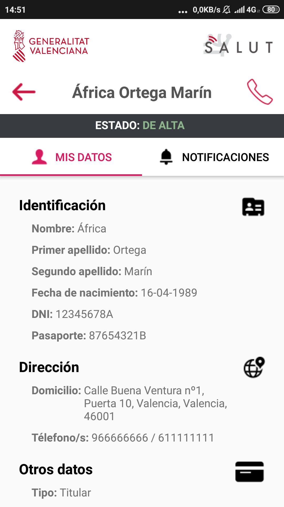
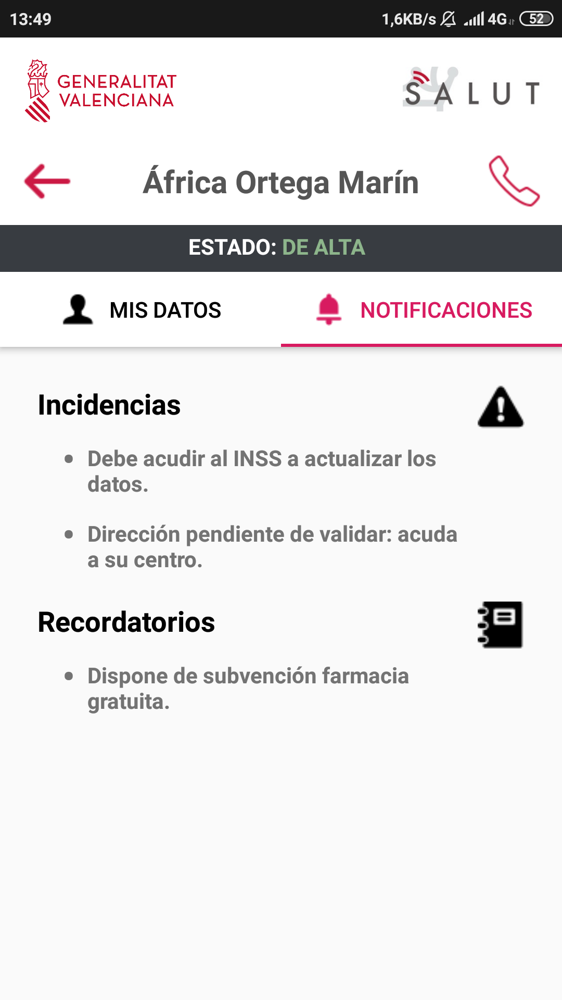
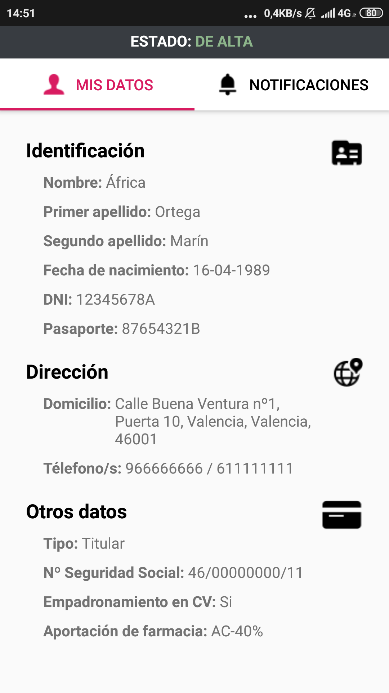
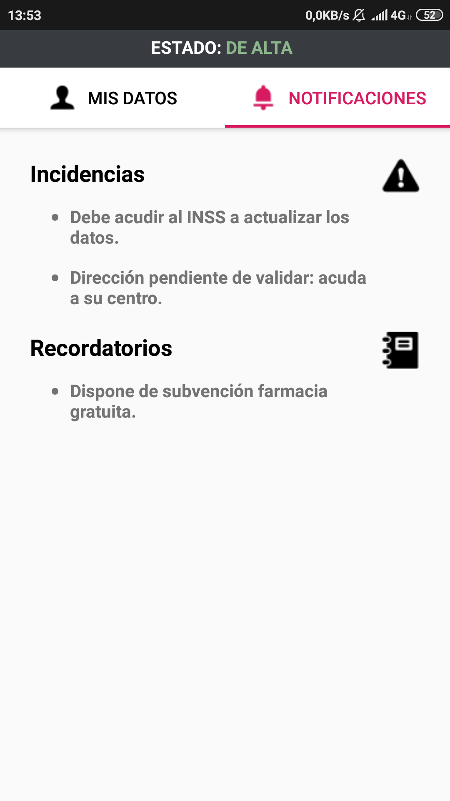

# PROTOTIPO DE DATOS GVASALUT
En este documento se va a mostrar visualmente el prototipo de la interfaz de datos del ciudadano en la aplicación móvil GVASalut. Además, se va a describir como se ha desarrollado, y con qué criterios respecto a 3 apartados: diseño, estructura y funcionalidades técnicas.

## MUESTRA VISUAL
<kbd></kbd>&emsp;&emsp;<kbd></kbd>

## DISEÑO
Se ha optado por un diseño simple, elegante y claro a la vista, facilitando así al ciudadano dónde puede ver cada dato de manera efectiva. Para ello se ha aplicado la usabilidad de colores, dando importancia en este caso a la cohesión entre el blanco, negro y rojo caramelo. A su vez, se ha apostado por la integración de un icono para identificar a cada sección, aumentando así considerablemente la claridad visual y dando un toque moderno a la interfaz.

## ESTRUCTURA
La estructura se ha construido persiguiendo 3 objetivos: que sea visible, efectiva y funcional. 
Empezando desde arriba, en la parte superior de la cabecera se ha respetado al máximo el estilo actual de la aplicación, donde podemos encontrar los logos de la GV y Salut. En tal caso, esta se ha expandido para dar cabida a los botones de “hacia atrás” y contacto, y el nombre completo del usuario.
A continuación se encuentra la barra de estado, que mostrará si el ciudadano está de Alta o de Baja (y el tipo de baja).
Justo debajo encontramos las dos principales secciones o bloques de esta interfaz, “Mis Datos” y “Notificaciones”,  que controlarán y cargarán el contenido que se muestra en pantalla. En Mis Datos, podemos ver toda la información personal relacionada a la Identificación, Dirección y Otros datos (datos acreditativos), mientras que en Notificaciones podemos encontrar las alertas.

## FUNCIONALIDAD
Uno de los elementos más importantes sobre las aplicaciones móviles es la simplicidad y la sensación positiva al usarlas. El uso de la app ha de ser fácil e intuitivo para al ciudadano y no al revés, lo que podría llegar a ser frustrante (y generar feedback negativo). Para ello, se ha puesto cierto énfasis en el deslizamiento horizontal y vertical de la pantalla.
En este caso, vemos que las secciones ya mencionadas se pueden seleccionar tanto tocando desde las propias pestañas estáticas, pero a su vez deslizando con el dedo en el contenido de la pantalla para lograr un uso intuitivo de la aplicación.
Además, cabe mencionar que la cabecera puede ocupar un espacio importante (que podría llegar a frustrar al usuario en caso de tener una pantalla pequeña), así que deslizando hacia abajo esta se oculta progresivamente, y por lo tanto se muestra más información en la parte del contenido de datos.

Muestra de la interfaz con la cabecera desplazada/oculta:

<kbd></kbd>&emsp;&emsp;<kbd></kbd>

